# 🏥 HealHub – Care At Your Fingertips

A full-stack **MERN Healthcare Appointment Booking Platform** that connects patients with doctors through a secure and intuitive web application. HealHub simplifies appointment scheduling, doctor availability management, and patient healthcare access with a modern user experience.

---

## 🌟 Features

### 👨‍⚕️ Doctor Portal
- 🔐 Secure Registration & Login
- 📅 Manage Availability
- 👥 Set Maximum Patients Per Time Slot
- ✅ Accept / ❌ Reject Appointment Requests
- 📋 View Patient Appointment History
- 👤 Professional Doctor Profile

### 🧑‍🤝‍🧑 Patient Portal
- 🔐 Secure Registration & Login
- 🔍 Search Doctors by Name & Specialization
- 👨‍⚕️ View Doctor Profiles
- 📅 Book Appointments
- 📌 Track Appointment Status
- 📊 Personalized Dashboard

### 🔒 Authentication & Security
- JWT Authentication
- Password Encryption using bcrypt
- Protected Routes
- Role-Based Access Control

### 💾 Database
- MongoDB Atlas Cloud Database
- Real-Time Data Persistence

### 🎨 User Interface
- Responsive Design
- Modern Healthcare Theme
- Personalized Welcome Section
- Health Tips
- Clean Dashboard Layout

---

# 🛠 Tech Stack

### Frontend
- React.js
- React Router DOM
- JavaScript (ES6)
- CSS3

### Backend
- Node.js
- Express.js

### Database
- MongoDB Atlas
- Mongoose

### Authentication
- JWT (JSON Web Tokens)
- bcrypt.js

### Development Tools
- Git
- GitHub
- VS Code
- Postman

---

# 📂 Project Structure

```text
HealHub/
│
├── backend/
│   ├── controllers/
│   ├── middleware/
│   ├── models/
│   ├── routes/
│   ├── config/
│   └── server.js
│
├── frontend/
│   ├── src/
│   │   ├── components/
│   │   ├── context/
│   │   ├── pages/
│   │   └── api.js
│
├── screenshots/
│
└── README.md
```

---

# 🚀 Key Functionalities

- Doctor Registration
- Patient Registration
- Secure Login
- Doctor Search
- Doctor Profiles
- Appointment Booking
- Doctor Availability Management
- Appointment Approval Workflow
- MongoDB Atlas Integration
- Responsive User Interface

---

# ⚙️ Installation

## Clone Repository

```bash
git clone https://github.com/SupratikVarun/HealHub-Care-At-Your-Fingertips.git
```

## Backend

```bash
cd backend
npm install
npm run dev
```

## Frontend

```bash
cd frontend
npm install
npm run dev
```

---

# 🌍 Environment Variables

Create a `.env` file inside the backend folder.

```env
PORT=5000
MONGO_URI=your_mongodb_connection_string
JWT_SECRET=your_secret_key
```

---

# 📸 Application Screenshots

Below are screenshots showcasing the key features and workflows of **HealHub** from both the **Patient** and **Doctor** perspectives.

---

# 🧑 Patient Module

### 🏠 Patient Home Page

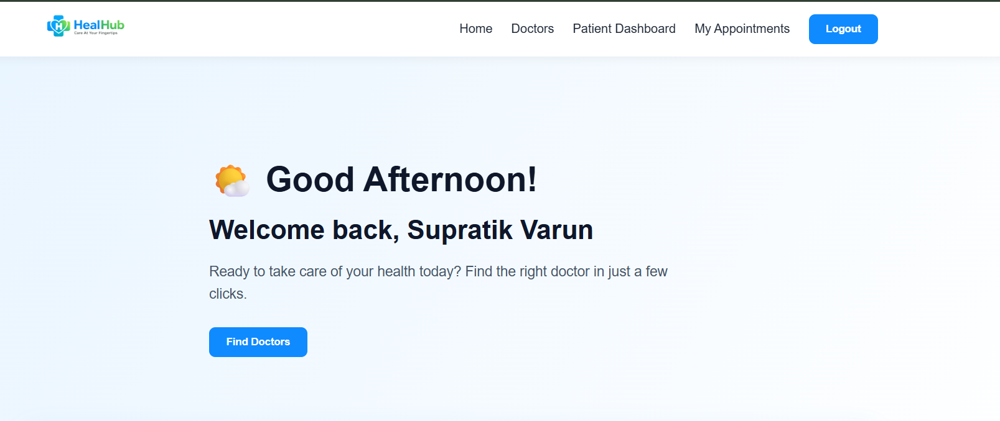

---

### 👤 Patient Registration

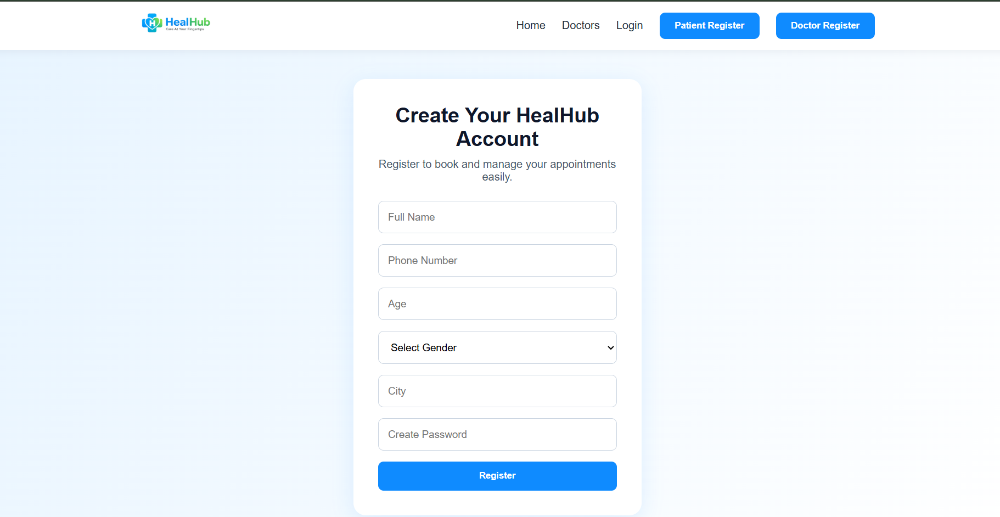

---

### 🔐 Patient Login


---

### 🔍 Search Doctors

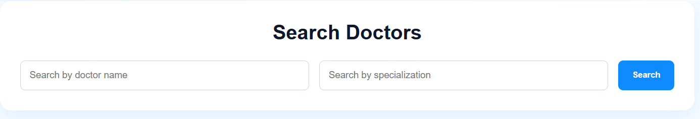

---

### 👨‍⚕️ Available Doctors

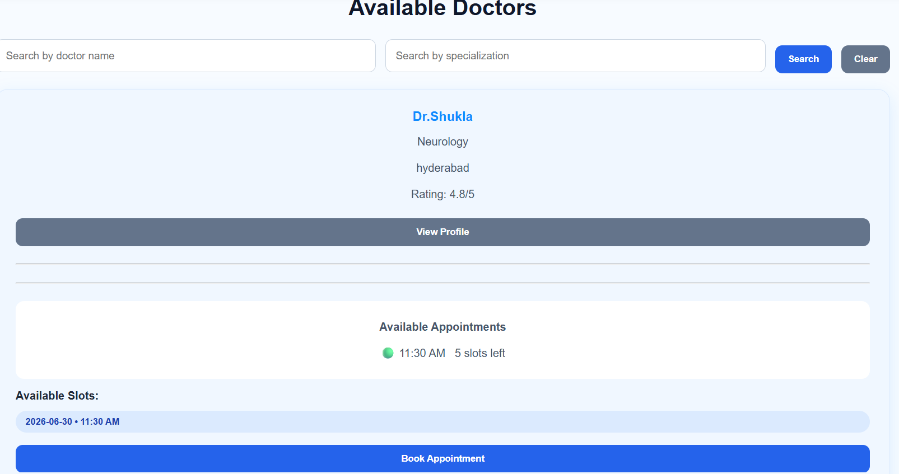

---

### 👨‍⚕️ Doctor Profile

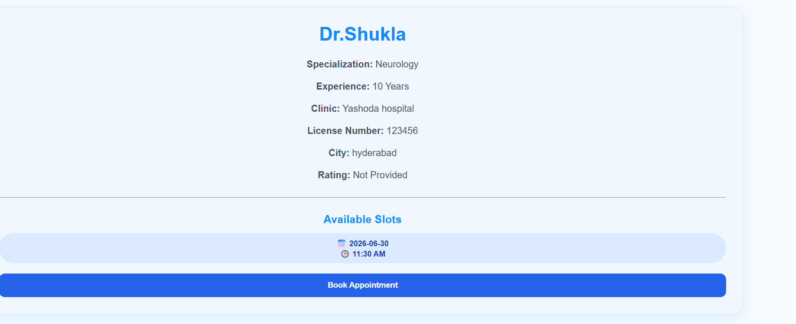

---

### 📅 Book Appointment

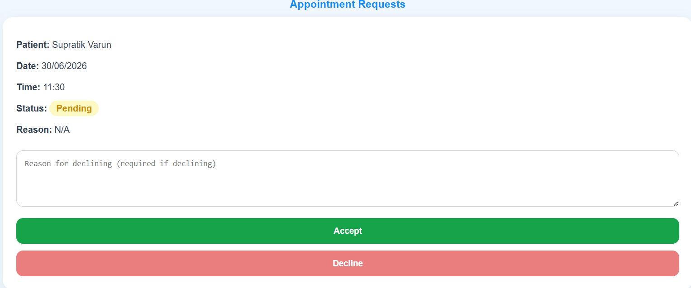

---

### 📋 My Appointments

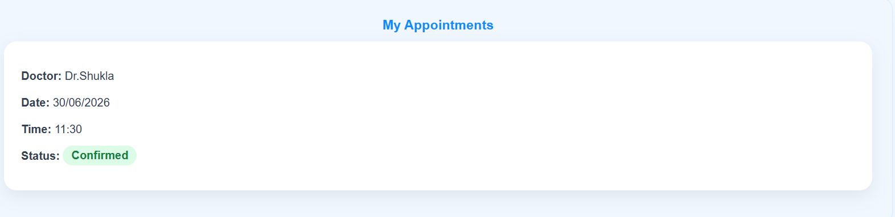

---

### 📊 Patient Dashboard

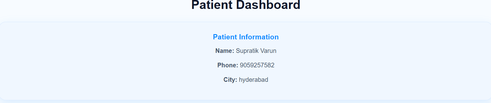

---

# 👨‍⚕️ Doctor Module

### 🏠 Doctor Home Page

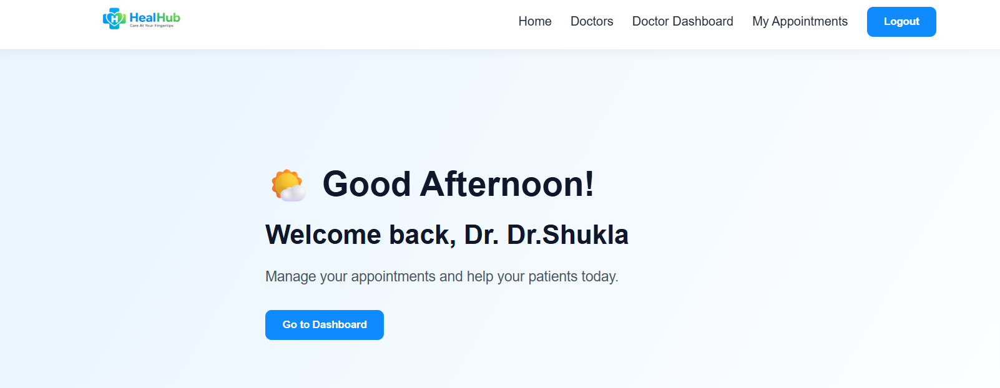

---

### 📝 Doctor Registration

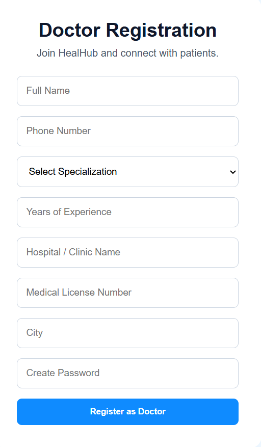

---

### 📊 Doctor Dashboard

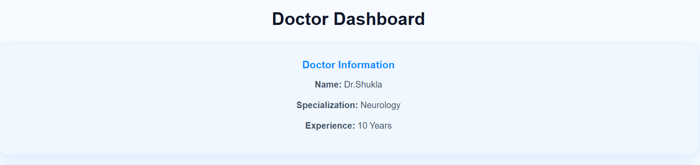

---

### 🗓️ Manage Availability

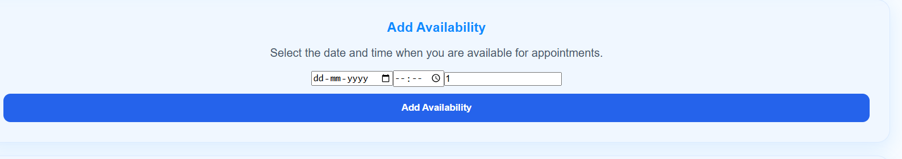

---

# 🔮 Future Enhancements

- 🎥 Video Consultation
- 📞 Voice Calling
- 💬 Real-Time Chat
- 🤖 AI Health Assistant
- 📄 Digital Prescriptions
- 💳 Online Payments
- ⭐ Doctor Ratings & Reviews
- 🔔 Email & SMS Notifications
- 📊 Admin Analytics Dashboard

---

# 🎯 Learning Outcomes

This project strengthened my understanding of:

- MERN Stack Development
- RESTful API Design
- JWT Authentication
- Role-Based Authorization
- MongoDB Atlas Integration
- State Management in React
- Full-Stack Application Development
- Secure User Authentication
- Git & GitHub Workflow

---

# 👨‍💻 Developer

**B. Supratik Varun Reddy**

🎓 B.Tech – Information Technology  
📍 Hyderabad, India

- GitHub: https://github.com/SupratikVarun
- LinkedIn: www.linkedin.com/in/supratik-varun-050048322

---

# ⭐ Support

If you found this project useful, consider giving it a ⭐ on GitHub!

---

> **HealHub – Care At Your Fingertips**  
> Making healthcare appointments simple, secure, and accessible.
